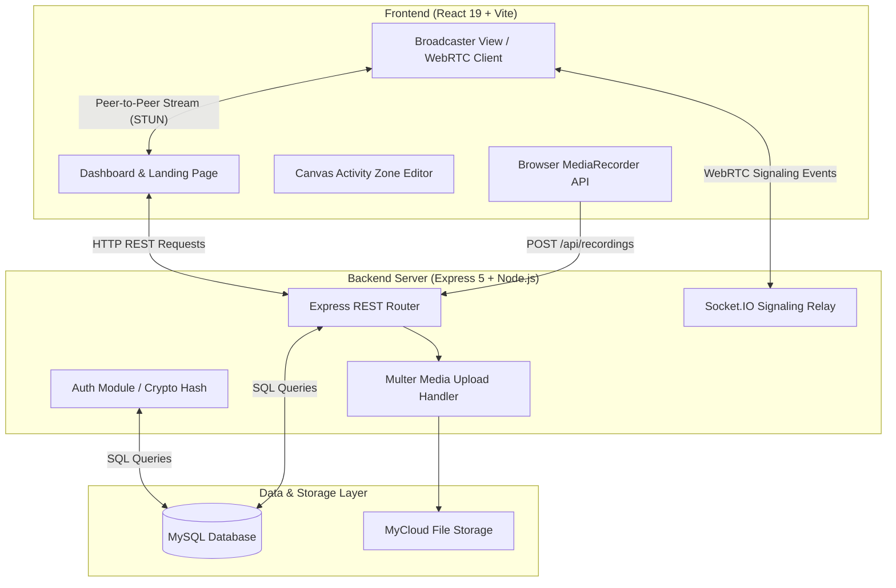
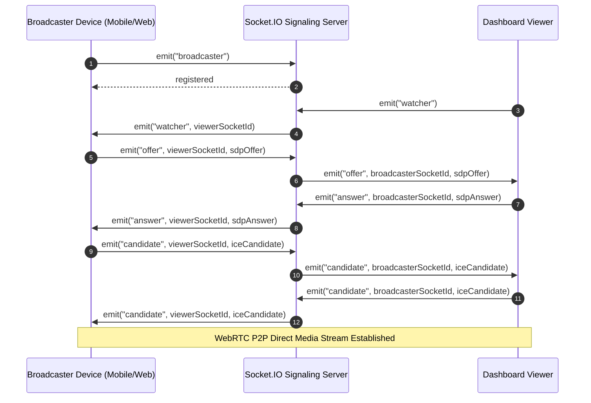

# myCam - Real-Time WebRTC Camera Security & Video Surveillance Platform

[](https://react.dev/)
[](https://vitejs.dev/)
[](https://tailwindcss.com/)
[](https://expressjs.com/)
[](https://socket.io/)
[](https://www.mysql.com/)
[](LICENSE)

A modern, web-based video surveillance and security camera management system built with React, Express, Socket.IO, WebRTC, and MySQL. **myCam** turns webcams and mobile browsers into live video broadcasting feeds, allowing users to monitor live feeds, draw custom motion alert activity zones on a canvas, record clips to local cloud storage, and manage device security settings.

---

## Overview

### What It Is
**myCam** is a full-stack security surveillance solution designed to connect browser-based video broadcasting devices (e.g., smartphones, laptops, webcams) directly to a unified monitoring dashboard via peer-to-peer WebRTC connections.

### Why It Exists
Commercial security solutions often require expensive proprietary hardware and closed ecosystems. **myCam** leverages open web standards (WebRTC, HTML5 MediaDevices, Canvas API) to transform spare mobile phones and webcams into secure IP cameras without requiring dedicated streaming hardware.

### Core Idea
- **Low-Latency Streaming**: Establish low-latency P2P video feeds between broadcaster devices and viewer dashboards.
- **Custom Activity Zones**: Allow users to interactively draw custom polygon detection zones over live video feeds.
- **Unified Recording Storage**: Capture clips directly in browser via `MediaRecorder` and automatically persist them to cloud storage attached to a MySQL relational database.

---

## Architecture

The project follows a decoupled client-server architecture consisting of a React SPA frontend, an Express REST API backend, a Socket.IO WebRTC signaling relay server, and a MySQL relational database layer.

### System Architecture Diagram



### WebRTC Signaling Sequence Diagram



---

## Current Features

### Authentication & User Management
- User Registration with password hashing using Node `crypto.scrypt`.
- Werkzeug-compatible password verification supporting `pbkdf2:sha256` and `scrypt` hashing formats.
- Login authentication with account verification check.
- Password reset request token generation and reset token confirmation flow.
- User profile update endpoint (`PUT /api/user/profile`).

### WebRTC Live Streaming & Broadcasting
- In-browser live camera broadcasting screen (`Broadcaster.jsx`) utilizing `navigator.mediaDevices.getUserMedia`.
- Audio and video mute/unmute toggles during live broadcast.
- Socket.IO signaling relay for RTCPeerConnection negotiation.
- Google STUN server (`stun:stun.l.google.com:19302`) configuration for NAT traversal.

### Live Camera Dashboard
- Camera grid displaying live WebRTC camera feeds and device cards.
- Add and remove camera endpoints for managing camera inventory.
- Fullscreen camera preview modal (`CameraModal.jsx`) with pan-tilt-zoom (PTZ) simulation controls, stream quality dropdown (4K, 1080p, SD), and snapshot trigger.

### Interactive Activity Zones (Canvas Editor)
- HTML5 Canvas overlay for drawing custom polygonal activity zones.
- Real-time coordinate normalization (x, y ratios relative to container width and height).
- Save drawn activity zones to MySQL database as JSON objects (`POST /api/zones`).
- Fetch and display active zones for specific cameras (`GET /api/zones`).
- Delete activity zones (`DELETE /api/zones/:id`).

### Video Recording & Storage Management
- Client-side stream recording using browser `MediaRecorder` API (`video/webm; codecs=vp9`).
- Video payload upload using `Multer` multipart storage (`POST /api/recordings`).
- Saved recordings library with filterable search, date sorting, download trigger, and share link copying.
- HTML5 Video playback modal (`VideoPlayerModal.jsx`).

### Public Landing Page & UI System
- Responsive dark-themed modern landing page with navigation bar, hero section, features list, integration overview, call to action, and footer.
- Custom Toast notification system (`ToastContext.jsx`).

---

## Project Structure

```text
myCam/
├── .env.example              # Sample environment configuration template
├── .gitignore                # Git ignore rule specifications
├── eslint.config.js          # ESLint rules configuration
├── index.html                # Entry point HTML template
├── package.json              # Package manifests and dependency listing
├── postcss.config.js         # PostCSS configuration for Tailwind CSS
├── tailwind.config.js        # Tailwind CSS theme and styling configuration
├── vite.config.js            # Vite build and plugin setup
│
├── mycloud_v0.4/             # Storage folder & legacy backend services
│   └── uploads/
│       └── mycam/            # Destination path for recorded video clips
│
├── public/                   # Static public assets
│
├── server/                   # Express Backend & Socket Server
│   ├── auth.cjs              # Authentication & password hashing (scrypt / pbkdf2)
│   ├── db.cjs                # MySQL connection pool & automatic table migration
│   ├── index.cjs             # Main Express server entry point & HTTP listener
│   ├── routes.cjs            # REST API endpoints (auth, zones, recordings, user profile)
│   └── socket.cjs            # Socket.IO WebRTC signaling relay server
│
└── src/                      # React SPA Frontend Application
    ├── App.jsx               # Main application routing and view switching logic
    ├── main.jsx              # DOM entry point initialization
    ├── index.css             # Tailwind base styles and directives
    │
    ├── context/
    │   └── ToastContext.jsx  # Toast notification provider and hook
    │
    └── components/
        ├── Broadcaster.jsx         # Standalone WebRTC Camera Broadcaster View
        ├── CallToAction.jsx        # Landing page Call to Action section
        ├── FeatureCard.jsx         # Feature card display component
        ├── Features.jsx            # Landing page Features grid
        ├── Footer.jsx              # Landing page Footer section
        ├── ForgotPassword.jsx      # Password reset request screen
        ├── Hero.jsx                # Landing page Hero section
        ├── IntegrationSection.jsx  # System integration details section
        ├── Login.css               # Auth screens styling overrides
        ├── Login.jsx               # User Login modal/screen
        ├── Navbar.jsx              # Landing page top navigation header
        ├── Register.jsx            # User Account Registration screen
        ├── ResetPassword.jsx       # Password reset confirmation screen
        │
        └── Dashboard/
            ├── ActivityZones.jsx   # Canvas polygonal activity zone drawer
            ├── CameraFeed.jsx      # Live video stream renderer component
            ├── CameraGrid.jsx      # Grid view of all connected camera devices
            ├── CameraModal.jsx     # Expanded live camera view with controls
            ├── Dashboard.jsx       # Main authenticated container layout
            ├── DashboardLayout.jsx # Base shell container layout
            ├── Recordings.jsx      # Video recordings library view
            ├── Settings.jsx        # User profile & notification settings
            ├── Sidebar.jsx         # Main navigation sidebar menu
            ├── TopBar.jsx          # Dashboard top bar with user profile & search
            └── VideoPlayerModal.jsx# Modal for playing saved recordings
```

---

## Technologies Used

### Frontend Stack

| Technology | Category | Purpose / Description |
| :--- | :--- | :--- |
| **React 19** | Library | Core component-based UI rendering framework |
| **Vite 7** | Build Tool | Development server and module bundler |
| **Tailwind CSS v4** | Styling | Utility-first styling framework |
| **Framer Motion** | Animation | UI micro-animations and smooth transitions |
| **Lucide React** | Icons | SVG icon set for dashboard components |
| **Socket.IO Client** | Networking | WebSockets client for signaling events |

### Backend Stack

| Technology | Category | Purpose / Description |
| :--- | :--- | :--- |
| **Node.js** | Runtime | JavaScript runtime environment |
| **Express 5** | Framework | Minimalist HTTP REST API web framework |
| **Socket.IO** | WebSockets | Real-time bidirectional WebRTC signaling server |
| **Multer** | Middleware | Multipart/form-data handler for video file uploads |
| **mysql2** | Database Client | Promise-based MySQL database driver |
| **dotenv** | Environment | Environment variable loader |

### Database & Security

| Component | Specification / Pattern |
| :--- | :--- |
| **Database Engine** | MySQL 8.0+ |
| **Password Hashing** | Werkzeug-compatible Node `crypto.scrypt` & `pbkdf2:sha256` |
| **WebRTC Signaling** | STUN Server (`stun:stun.l.google.com:19302`) + Socket.IO |

---

## Environment Variables

Copy `.env.example` to `.env` in the root directory before launching the backend server.

| Variable Name | Required | Default Value | Description / Purpose |
| :--- | :--- | :--- | :--- |
| `DB_HOST` | Yes | `127.0.0.1` | Hostname or IP address of the MySQL database server |
| `DB_USER` | Yes | `root` | Database user account name |
| `DB_PASSWORD` | Yes | *None (Empty)* | Database user authentication password |
| `DB_NAME` | Yes | `mycloud_db` | Name of the database schema |
| `PORT` | No | `3000` | Port on which the Express REST API & Socket server listens |

*Security Warning: Never commit your actual `.env` file to version control repositories.*

---

## Installation & Setup

### Prerequisites

Ensure you have the following installed on your machine:
- **Node.js**: v18.0.0 or higher
- **npm**: v9.0.0 or higher
- **MySQL Server**: v8.0 or higher

### Step 1: Clone the Repository

```bash
git clone https://github.com/rudy-07/myCam.git
cd myCam
```

### Step 2: Install Dependencies

```bash
npm install
```

### Step 3: Configure Database & Environment

1. Ensure MySQL Server is running locally or on your target host.
2. Create the target schema if it does not already exist:
   ```sql
   CREATE DATABASE mycloud_db;
   ```
3. Create a `.env` file in the project root:
   ```bash
   cp .env.example .env
   ```
4. Edit `.env` to match your local MySQL credentials.

### Step 4: Run the Application

Start the Express backend server and Vite frontend server concurrently or in separate terminal sessions.

**Terminal 1 (Backend API & Socket Server):**
```bash
npm run server
```
*The backend server will automatically initialize required database tables (`password_resets`, `activity_zones`, `recordings`) on startup.*

**Terminal 2 (Frontend Client App):**
```bash
npm run dev
```

Open your browser and navigate to `http://localhost:5173`.

---

## API Documentation

### Authentication Routes

#### `POST /api/register`
Registers a new user account.

- **Request Body**:
  ```json
  {
    "name": "John Doe",
    "username": "johndoe",
    "email": "john@example.com",
    "password": "SecurePassword123"
  }
  ```
- **Response** `(201 Created)`:
  ```json
  {
    "message": "User registered successfully"
  }
  ```

#### `POST /api/login`
Authenticates a user against credentials.

- **Request Body**:
  ```json
  {
    "username": "johndoe",
    "password": "SecurePassword123"
  }
  ```
- **Response** `(200 OK)`:
  ```json
  {
    "success": true,
    "user": {
      "id": 1,
      "username": "johndoe",
      "name": "John Doe",
      "profile_pic": null
    }
  }
  ```

#### `POST /api/forgot-password`
Generates a 1-hour expiration password reset token for the specified email.

- **Request Body**:
  ```json
  {
    "email": "john@example.com"
  }
  ```

#### `POST /api/reset-password`
Resets a user's password using a valid token.

- **Request Body**:
  ```json
  {
    "token": "d7a4e...",
    "newPassword": "NewSecurePassword123"
  }
  ```

---

### Activity Zones Routes

#### `GET /api/zones?user_id=:id`
Retrieves all configured activity zones for a user.

- **Response** `(200 OK)`:
  ```json
  [
    {
      "id": 1,
      "user_id": 1,
      "camera_id": "mobile",
      "name": "Front Porch Zone",
      "coordinates_json": [
        { "x": 0.12, "y": 0.34 },
        { "x": 0.45, "y": 0.34 },
        { "x": 0.45, "y": 0.89 }
      ],
      "created_at": "2026-07-31T18:00:00.000Z"
    }
  ]
  ```

#### `POST /api/zones`
Saves a new polygonal activity zone.

- **Request Body**:
  ```json
  {
    "user_id": 1,
    "camera_id": "mobile",
    "name": "Driveway Zone",
    "coordinates": [
      { "x": 0.1, "y": 0.2 },
      { "x": 0.5, "y": 0.2 },
      { "x": 0.5, "y": 0.7 }
    ]
  }
  ```

#### `DELETE /api/zones/:id`
Deletes an activity zone by ID.

---

### Video Recordings Routes

#### `GET /api/recordings?user_id=:id`
Fetches all stored recordings associated with a user.

#### `POST /api/recordings`
Uploads a new video clip recorded via `MediaRecorder`.

- **Request Headers**: `Content-Type: multipart/form-data`
- **Form Fields**:
  - `user_id`: User ID (Number)
  - `camera_id`: Camera Identifier String (e.g. `mobile`)
  - `duration`: Recording duration string (e.g. `00:45`)
  - `video`: Binary WebM video file payload

---

## Database Schema

### `users` Table *(Pre-existing or created schema)*
| Column | Type | Constraints | Description |
| :--- | :--- | :--- | :--- |
| `id` | `INT` | `AUTO_INCREMENT, PRIMARY KEY` | User primary key |
| `username` | `VARCHAR(255)` | `UNIQUE, NOT NULL` | Unique account username |
| `email` | `VARCHAR(255)` | `UNIQUE, NOT NULL` | User email address |
| `password` | `VARCHAR(255)` | `NOT NULL` | Werkzeug scrypt/pbkdf2 password hash |
| `name` | `VARCHAR(255)` | `NULLABLE` | Display full name |
| `profile_pic` | `VARCHAR(255)` | `NULLABLE` | Profile picture URL |
| `is_verified` | `TINYINT(1)` | `DEFAULT 1` | Verification flag status |
| `created_at` | `DATETIME` | `DEFAULT CURRENT_TIMESTAMP` | Account creation timestamp |

### `password_resets` Table
| Column | Type | Constraints | Description |
| :--- | :--- | :--- | :--- |
| `email` | `VARCHAR(255)` | `PRIMARY KEY` | Targeted user email |
| `token` | `VARCHAR(255)` | `NOT NULL` | Randomly generated reset token |
| `expires_at` | `DATETIME` | `NOT NULL` | Expiration timestamp |

### `activity_zones` Table
| Column | Type | Constraints | Description |
| :--- | :--- | :--- | :--- |
| `id` | `INT` | `AUTO_INCREMENT, PRIMARY KEY` | Zone identifier |
| `user_id` | `INT` | `FOREIGN KEY (users.id) ON DELETE CASCADE` | Associated user ID |
| `camera_id` | `VARCHAR(50)` | `NOT NULL` | Camera identifier tag |
| `name` | `VARCHAR(100)` | `NOT NULL` | Display name of the zone |
| `coordinates_json` | `JSON` | `NOT NULL` | Array of `{x, y}` normalized polygon points |
| `created_at` | `DATETIME` | `DEFAULT CURRENT_TIMESTAMP` | Creation timestamp |

### `recordings` Table
| Column | Type | Constraints | Description |
| :--- | :--- | :--- | :--- |
| `id` | `INT` | `AUTO_INCREMENT, PRIMARY KEY` | Recording identifier |
| `user_id` | `INT` | `FOREIGN KEY (users.id) ON DELETE CASCADE` | Associated user ID |
| `camera_id` | `VARCHAR(50)` | `NOT NULL` | Camera identifier tag |
| `filename` | `VARCHAR(255)` | `NOT NULL` | Stored video filename |
| `duration` | `VARCHAR(20)` | `NOT NULL` | Length formatted as `MM:SS` |
| `thumbnail_url` | `VARCHAR(255)` | `NULLABLE` | Optional thumbnail path |
| `created_at` | `DATETIME` | `DEFAULT CURRENT_TIMESTAMP` | Recording timestamp |

---

## Current Progress

### Backend Services
- [x] User Authentication & Werkzeug Hashing Verification
- [x] Password Reset Token Workflow
- [x] Socket.IO WebRTC Signaling Server
- [x] Multer Video Recording Storage Engine
- [x] Activity Zones JSON Persistence API
- [ ] Automated Computer Vision Motion Detection Trigger Engine
- [ ] Production Cloud Storage Integration (AWS S3 / GCP Bucket)

### Frontend Application
- [x] Responsive Marketing Landing Page & Navbar
- [x] Authentication Modals (Login, Register, Forgot Password)
- [x] WebRTC Broadcaster Mode (`Broadcaster.jsx`)
- [x] Live Camera Feed Grid Layout & Modal Preview (`CameraGrid.jsx`)
- [x] PTZ Control Interface & Stream Quality Selectors
- [x] Canvas Activity Zone Interactive Drawer (`ActivityZones.jsx`)
- [x] Video Recording Capture & Upload (`CameraModal.jsx`)
- [x] Recordings Gallery Library with Download & Share Options
- [x] User Profile & Notification Preferences Panel
- [ ] Synchronized Multi-Camera Grid Playback View
- [ ] Cross-Platform Native Mobile Application

### Testing
- [ ] Unit & Integration Test Suites
- [ ] End-to-End Cypress / Playwright Test Automation

---

## Roadmap

### Phase 1: Core Surveillance Enhancements *(In Progress)*
- Add server-side static video file streaming endpoint (`/api/videos/:filename`) for instant web clip streaming.
- Implement server-side WebRTC TURN server fallback handling for strict NAT network environments.

### Phase 2: AI & Motion Detection Integration
- Integrate client-side TensorFlow.js object detection model (COCO-SSD) to detect persons/objects inside user-defined activity zones.
- Implement server-side frame extraction and motion alert notification triggers.

### Phase 3: Cloud & Multi-Tenancy Expansion
- Add Amazon S3 / Google Cloud Storage object storage integration for recordings persistence.
- Implement multi-user camera sharing permissions and guest view links.

---

## Contributing

We welcome contributions to **myCam**! Please adhere to the following Git workflow guidelines when contributing code.

### Git Branching Model
- **`main`**: Production-ready branch. All changes are merged via reviewed Pull Requests.
- **`rudy-backend`**: Active development branch for backend integrations.
- **Feature Branches**: Name feature branches according to component (`feature/motion-detection`, `fix/socket-reconnect`, `refactor/auth-middleware`).

### Contribution Workflow
1. Fork the repository on GitHub.
2. Clone your fork locally and check out a new feature branch:
   ```bash
   git checkout -b feature/your-feature-name
   ```
3. Commit your changes with concise, descriptive commit messages.
4. Push your feature branch to your fork:
   ```bash
   git push origin feature/your-feature-name
   ```
5. Open a **Pull Request (PR)** against the `main` branch of `https://github.com/rudy-07/myCam`.
6. Request a code review and ensure all feedback items are resolved prior to merging.

---

## License

This project is licensed under the [MIT License](LICENSE).

---

## Acknowledgements

- [React.js](https://react.dev/) and [Vite](https://vitejs.dev/) for fast frontend tooling.
- [Socket.IO](https://socket.io/) for WebSockets signaling relay capabilities.
- [Lucide Icons](https://lucide.dev/) for clean UI iconography.
- [Tailwind CSS](https://tailwindcss.com/) for modern layout design capabilities.
