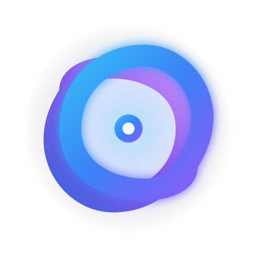
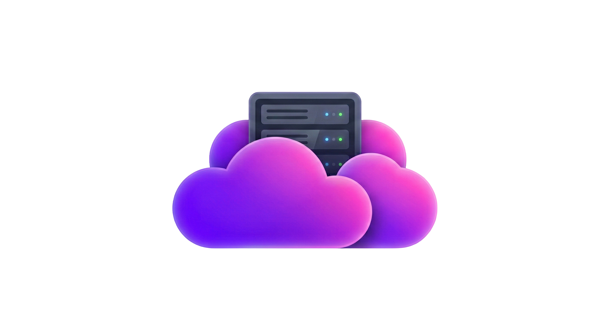

# myCam Brand Identity & Redesigned Logo Proposals

> [!IMPORTANT]
> **Complete Redesign Based on Your Feedback**:
> We listened carefully and completely stepped away from the previous harsh sci-fi/cyberpunk aesthetic. Instead, these new concepts are **directly anchored in the visual DNA of mySphere and myCloud**:
> - **Tactile 3D / Claymorphic & Glassmorphic forms** (smooth, pillowy, friendly, premium consumer-grade product design).
> - **Soft, elegant gradients**: Royal Blue (`#3B82F6`), Lilac/Violet (`#8B5CF6`), Magenta-Purple, and subtle Cyan.
> - **Clean presentation with natural ambient soft drop shadows** (designed to be transparent and float seamlessly on both dark and light surfaces).
> - **Zero AI/vibe-coded slop**: Pure, deliberate product icon design akin to modern macOS / iOS / Apple Design Award winners.

---

## Ecosystem Reference Benchmarks

Here are the two benchmark logos from your parent workspace that guided this redesign:

| mySphere (Reference) | myCloud (Reference) |
| :---: | :---: |
|  |  |
| *Smooth interlocking blue & purple torus with frosted glass core* | *Tactile claymorphic purple/magenta cloud with embedded server blade* |

---

## Redesigned Logo Options for myCam

### Option 1: "The Sibling Glass Lens" (Exact mySphere DNA)
- **Concept**: A direct evolution of the `mySphere` logo. Smooth, continuous rounded torus ribbon in royal blue and violet overlapping a frosted translucent glass camera lens disc with an embedded aperture shutter in the center.
- **Why It Fits**: Shares the exact same geometry, curvature, and lighting as `mySphere`, while clearly communicating camera/optics.
- **Aesthetic**: Ultra-clean, soft glassmorphic, friendly, and minimalist.

---

### Option 2: "The Tactile Camera Pebble" (Exact myCloud DNA)
- **Concept**: Directly mirrors the 3D claymorphic finish and purple-magenta gradient palette of `myCloud`. Features a soft, pillowy camera body with velvety matte shading, holding a sleek embedded dark glass lens with concentric optical elements and a tiny green indicator LED.
- **Why It Fits**: Creates an instant, recognizable product family with `myCloud`. Anyone seeing both side by side knows they are sister products.
- **Aesthetic**: Friendly, tactile, modern hardware design, premium app icon.

---

### Option 3: "The Azure Vision Pebble" (mySphere Palette + Tactile Form)
- **Concept**: Combines the claymorphic soft-touch pebble form with the signature royal blue and cyan color palette of `mySphere`. A smooth rounded camera squircle with a prominent glossy multi-element lens and a gentle status indicator light.
- **Why It Fits**: Maintains the blue/cyan brand accents of the myCam web application (`tailwind.config.js`) in a soft, premium tactile form.
- **Aesthetic**: Minimalist Cupertino-style camera badge, high legibility.

---

### Option 4: "The Modern Glass Aperture Disc" (Refined Geometric Focus)
- **Concept**: Taking the clean circular focus ring / aperture idea from the previous Option 5 and completely elevating it with `mySphere`-style soft glassmorphism. Features a smooth blue-to-indigo outer bezel housing layered translucent frosted glass aperture blades with soft ambient drop shadows.
- **Why It Fits**: Pure geometric camera icon without being harsh or flat; delivers depth, elegance, and razor-sharp symmetry.
- **Aesthetic**: Sophisticated, architectural, balanced.

---

### Option 5: "The Smart Dome Sentinel" (Physical Surveillance Object)
- **Concept**: A friendly 3D surveillance dome sculpted in satin matte porcelain white with lilac/indigo accents. Features a dark curved panoramic glass lens with an illuminated cyan pupil and a subtle torus ring crown on top (referencing the mySphere torus).
- **Why It Fits**: Specifically embodies video surveillance / security hardware in a sleek, non-intrusive, consumer-friendly aesthetic (like Teenage Engineering or Google Nest).
- **Aesthetic**: Physical product design, tactile, distinct.

---

### Option 6: "The Nexus Vision Ribbon" (Interlocking Torus + Aperture)
- **Concept**: Two continuous, interlocking rounded ribbons in vibrant royal blue (`#3B82F6`) and violet (`#8B5CF6`) forming an optical loop around a frosted glass camera aperture iris with a glowing cyan focal sensor node in the center.
- **Why It Fits**: Balances the dual-loop ribbon language of `mySphere` with high-visibility camera optics and central focus.
- **Aesthetic**: Dynamic, premium SaaS identity, fluid and iconic.

---

## Production Deliverables Ready Upon Selection

Once you select your preferred design:
1. **Transparent Background Master**: High-res transparent PNGs (`mycam_no_text.png`, `mycam_vector.png`, `mycam_logo_transparent.png`).
2. **Standard Favicon & App Icons**:
   - `public/favicon.ico` (multi-res 16, 32, 48px)
   - `public/favicon.png` (32x32)
   - `public/apple-touch-icon.png` (180x180)
   - `public/android-chrome-192x192.png` & `512x512.png`
3. **Frontend Integration**:
   - Re-linking `Navbar.jsx`, `Hero.jsx`, `Sidebar.jsx`, `TopBar.jsx`, `Login.jsx`, and `index.html`.
   - Running `npm run build` to ensure 0 build errors.
4. **Git Staging**: Staged and committed cleanly so your frontend collaborator has direct access to the entire asset library.
